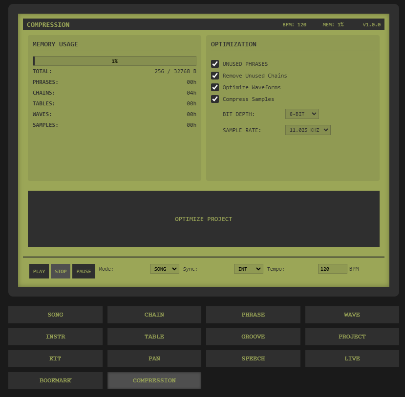

# Web LSDJ

A web-based music tracker inspired by LSDJ (Little Sound DJ), designed to emulate the Game Boy sound chip. This project allows you to create chiptune music directly in your browser using modern web technologies.

## PROJECT NOT FINISHED!!!!

Currently, the project is in the development phase, and not all sections are working correctly. It’s a large project that requires a lot of time and knowledge (which I don’t fully have). So far, I've made it to this point. This is a project I started out of personal interest and curiosity about how chiptune trackers work. I would appreciate it if you’re not too harsh in your criticism if something doesn’t work. I’m doing what I can... I would welcome any feedback from people with more expertise so I can add new features and apply more efficient solutions. THANK YOU!

PD: I'm not a native English speaker, so I apologize for any mistakes in the text. The code comments are in Spanish. I forgot to change them. SORRY! if you want to help me translate it to English, please let me know or do it yourself and make a pull request.

THANKS!

### The Idea

The goal is to create a web-based music tracker that emulates the Game Boy sound chip, enabling users to create and play chiptune music directly in their browser, with features inspired by LSDJ. However, it may have gotten a bit out of hand.

## Features

- **4-Channel Sound System**:
  - 2 Pulse Wave channels with variable duty cycles (12.5%, 25%, 50%, 75%)
  - 1 Programmable Wave channel with custom waveform support
  - 1 Noise channel for percussion and sound effects

- **Advanced Sound Control**:
  - Envelope control (ADSR: Attack, Decay, Sustain, Release)
  - Vibrato and sweep effects with customizable parameters
  - Stereo panning control (Left, Center, Right)
  - Volume control (0-F in hexadecimal)
  - Multiple waveform types for Wave channel
  - Noise shape control for percussion

- **Sequencer Features**:
  - 16-step phrases with note, instrument, and volume control
  - Chain system for pattern arrangement (16 steps per chain)
  - Table system for advanced effects and automation
  - Groove control for rhythm variations and swing
  - Transpose control per chain step
  - Effect commands per step (Volume, Panning, Sweep, etc.)

- **Modern Interface**:
  - Game Boy inspired design with modern usability
  - Real-time waveform visualization for all channels
  - Volume meters for monitoring
  - Live mode for keyboard performance
  - Project management system with save/load functionality
  - Comprehensive keyboard shortcuts

## Technical Details

### Audio Engine
- Built on Web Audio API through Tone.js
- Sample rate: 44.1kHz
- Bit depth: 16-bit
- 4 independent audio channels
- Real-time audio processing
- Low latency playback

### Performance
- Optimized for modern browsers
- Efficient CPU usage through Web Audio API
- Smooth playback at 60 FPS
- Responsive interface even during playback

### File Format
- Projects saved in JSON format
- Support for importing/exporting projects
- Backward compatibility system
- Compressed storage format

## Advanced Usage

### Keyboard Shortcuts
- **Navigation**
  - Q-P: Switch between screens
  - Arrow keys: Navigate within screens
  - Space: Insert/edit note
  - Delete: Remove note
  - Enter: Play/Stop

- **Edit Mode**
  - 0-9, A-F: Hex input
  - +/-: Transpose up/down
  - Ctrl+C/V: Copy/Paste
  - Ctrl+Z: Undo
  - Ctrl+Y: Redo

### Effect Commands
- VOL: Volume change
- PAN: Stereo panning
- ARP: Arpeggio
- VIB: Vibrato
- SWEEP: Frequency sweep
- DELAY: Delay effect
- BEND: Pitch bend
- PORT: Portamento
- RES: Resonance
- DIST: Distortion
- ECHO: Echo
- FLANG: Flanger
- CHOR: Chorus
- RING: Ring modulation
- SYNC: Hard sync

### Sound Design Tips
1. **Pulse Channels**
   - Use different duty cycles for variety
   - Combine channels for fuller sound
   - Use sweep for bass sounds

2. **Wave Channel**
   - Create custom waveforms for unique timbres
   - Use for bass or melodic parts
   - Combine with effects for rich sounds

3. **Noise Channel**
   - Vary the noise shape for different textures
   - Use short envelopes for percussion
   - Combine with pitch for tonal effects

## Development

### Building from Source

## Requirements

### System Requirements
- Node.js 16.x or higher
- npm 7.x or higher
- At least 2GB of RAM
- Modern web browser with Web Audio API support

### Browser Requirements
- Chrome 66+ (recommended)
- Firefox 75+
- Safari 12+
- Edge 79+

### Development Requirements
- Git
- Code editor (VS Code recommended)
- Terminal/Command Line interface
- Basic knowledge of TypeScript and React

## 📦 Installation and Deployment

### Prerequisites

1. **Bun or Node.js**
2. Clone the repository
3. Install dependencies
```bash
bun install
```
4. Start the development server
```bash
bun run dev
```

### Building for Production
```bash
bun run build
```
### 🤝 Contributing

If you'd like to contribute to this project, please follow these steps:

1. Fork the repository
2. Create a new branch
3. Make your changes and commit them
4. Push your changes to your fork
5. Create a pull request

All contributions are welcome!

Any issues or suggestions can be reported on the [issue tracker](https://github.com/CerealKillerjs/LSDJ-Web/issues).

### Thanks

- [LSDJ](https://www.littlesounddj.com/) for the original project
- [Tone.js](https://tonejs.github.io/) for the audio engine
- [React](https://react.dev/) for the UI library
- [Tailwind CSS](https://tailwindcss.com/) for the styling
- [Vite](https://vitejs.dev/) for the build tool
- [Bun](https://bun.sh/) for the package manager

### Screenshots

Init


Song


Compression Manager


Project
